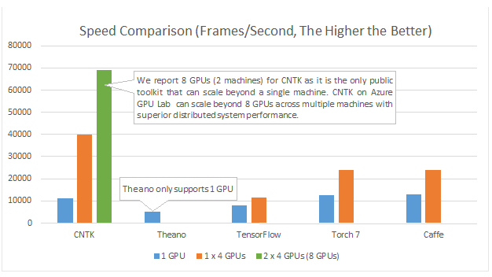

# CNTK

在Google推出TensorFlow的N年之后，微软，终于发布了自家的机器学习工具集--微软认知工具集（Microsoft Cognitive Toolkit）。

你很可能想知道，在TensorFlow已经出到2.0，PyTorch等如火如荼的今天，为什么要去学习CNTK。

因为更高的性能？

你真的拥有八块GPU嘛？

以及CNTK其实也并没有在学习率上碾压其他平台：

那么为什么呢？

我不知道你有没有注意到他的开发厂商，微软。

没错，微软（不是巨硬

Come on，难道你还需要其他的理由吗？

## 学习

本系列文章假设你对机器学习拥有一定基础知识。并将直接从CNTK 200系列的教程开始。如果你还不理解机器学习是什么的话，我们在此强烈推荐你先看看由Andrew Ng先生执教的[机器学习](https://www.coursera.org/learn/machine-learning/home/welcome)。

## 后记

有人可能注意到这篇文章其实已经挂在这里半年多了，但是我一直没动笔去写……

我当时选择了计算机视觉的课程，并期望使用CNTK作为框架。但后来发现我完全没有时间从零开始学习一门新的框架并用于实际课程当中。

现在，是时候开始新的征程了。
