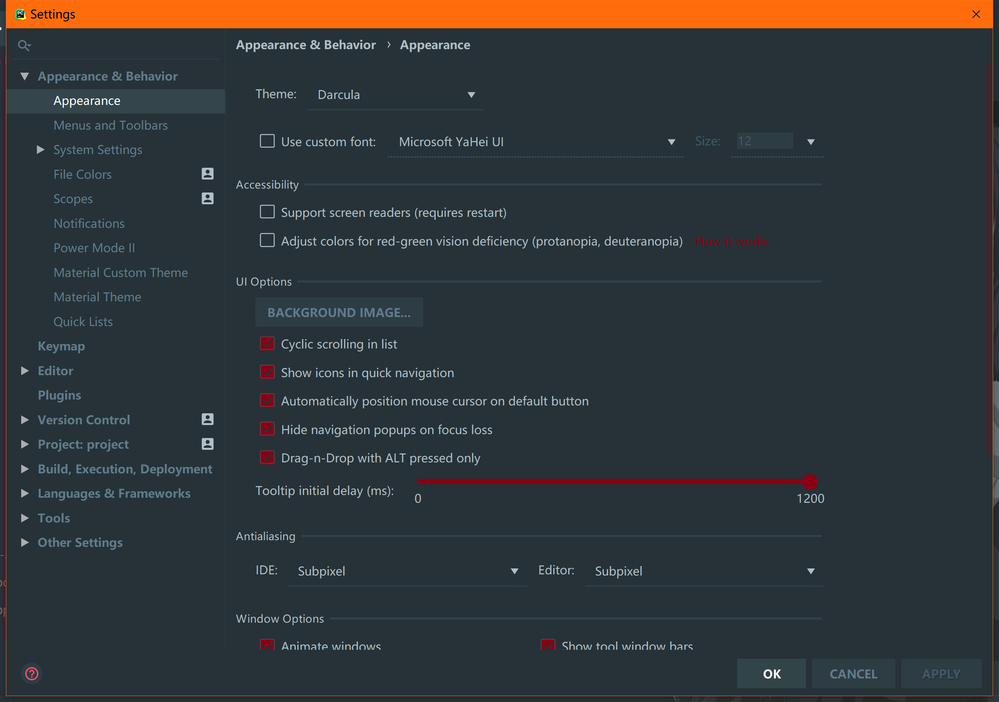
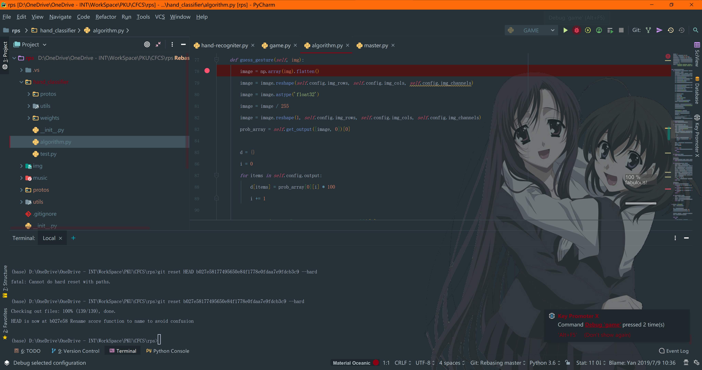

# JetBrains使用指南

今天群里有同学说我IDEA界面十分奇特，讨论之后发现很多同学都对IDE的插件不太熟悉，这里简单讨论一下如何漂亮的使用JetBrains全家桶。

首先，来一张我的PyCharm界面截图。

## 插件

我们还是从插件开始吧（由于Python我写的相对较少一些，并且更常用宇宙最强IDE，所以插件比较少一些），我主要用到的插件列表如下：

这里强烈推荐Material Theme UI这个插件（虽然我更喜欢Fluent Design，但这个似乎没人做就只能将就一下了），它能让你的整个心情都好起来。其次Power Mode II能让你敲代码时出现Kira-Kira的效果（但我强烈建议你同时在选项中去掉喷火，完全是画蛇添足好嘛？！）。CodeGlance能让你大致的看到代码的情况（在屏幕最右侧）。最重要的莫过于Rainbow Brackets，尤其是在你追求一行代码时，让你能对括号的使用情况一目了然。此外LiveEdit能允许你和别人同时工作，带妹写代码什么的没有什么比这个更好了（当然让她做怀里帮她写除外）。如果你是一个VIM爱好者的话，IdeaVim能很有限的实现一些功能；如果你不是一个VIM爱好者的话，用VIM就能帮助你把右手从恼人的鼠标操作当中解放出来，真的不考虑成为一下吗？哦对了，GitToolBox和GitLab Projects也很有用，能在代码当中显示这行垃圾是谁在什么时候最后编辑的，甩锅神器（所以代码是什么垃圾？）。最后，还有传说中脚踢IntelliSense的TabNine，这个绝对好用，信我。

## 美化

说到界面，很多人都问我背景图片是怎么做到的。这个东西，对于VS来说是需要专门装一个插件，但优秀的JetBrains已经机智的内置了这种功能。除此之外，字体字号等等等等，一切的一切尽在Appearance当中。

如图设置好图片，我们就能快乐的日在校园了（误）。

## 代码

接下来说一个正经的代码技巧。

打断点（我没想到居然这么多人不会这个，辛苦了）。

所谓断点，就是程序运行到这里遍暂停的点。从此处开始，你将手动一行一行的执行代码，观察各个变量看看是否有非期待的结果。以下多图杀猫预警。

首先，我们在怀疑出问题代码之前的行号右侧按一下，会出现这样的一个小红点，即表示你在这里打了一个断点。与以往不同的是，调试的时候我们会按这个红色的小虫子，快捷键为Alt F5。

随后，代码会执行到代码之前一行停止。

我们可以看到，下面的调试面板中显示出了目前的变量及其值。

我们可以在这里选择执行下一行代码。他左边黄色向下箭头也是执行下一行代码，但他执行的是任何下一行代码。如果你用库的话，那可能会在这里跳很多次。而这个蓝色的向下箭头则会忽略库的代码。更左边紫色箭头则是只执行本文件内的代码，这个实际上是最常用的。

有些时候，我们的错误在循环里发生，要怎么办呢？每de一次bug按上万八千次Step Into么？JetBrains自然是没有这么睿智的。右键点击你刚设置好的断点，会弹出一个对话框让你设置中断的条件。这里用代码描述一下就可以啦。

## 环境

首先先提一下文件夹的标志，有些时候这是很重要的，尤其是在你不知何故打开了一个很大包含很多项目的文件夹的时候。也很简单，右键点一下文件夹找到Mark Directory as就好。

### Intellij IDEA

在Project Structure里设置环境。

依赖也在这里设置，不过现在这个年代，为什么不用Maven呢？

### PyCharm

与Java不同，PyCharm并没有单独的项目设置，环境是在设置里的Project一栏进行设置的。在这里可以使用Conda创建虚拟环境，也可以直接使用venv创建虚拟环境。对于懒惰的我来说……自然是只用一个根环境啦（这是一个不好的习惯千万不要学我）。

 

!!! abstract "结语"
    唔，仔细想想，好像也没什么需要写的了？相比VIM来说，IDE体积要大数千倍，功能自然也会强很多倍。从快捷键比如sout = System.out.println()、Ctrl /注释代码、Ctrl Tab/Shift Tab调整行距，到自动格式化、自动注释、自动生成构造器，有太多能写的内容没有办法在一篇文章当中详尽描述。更多的需要在实际代码当中去体会。那么，我们今天就到这里吧~
