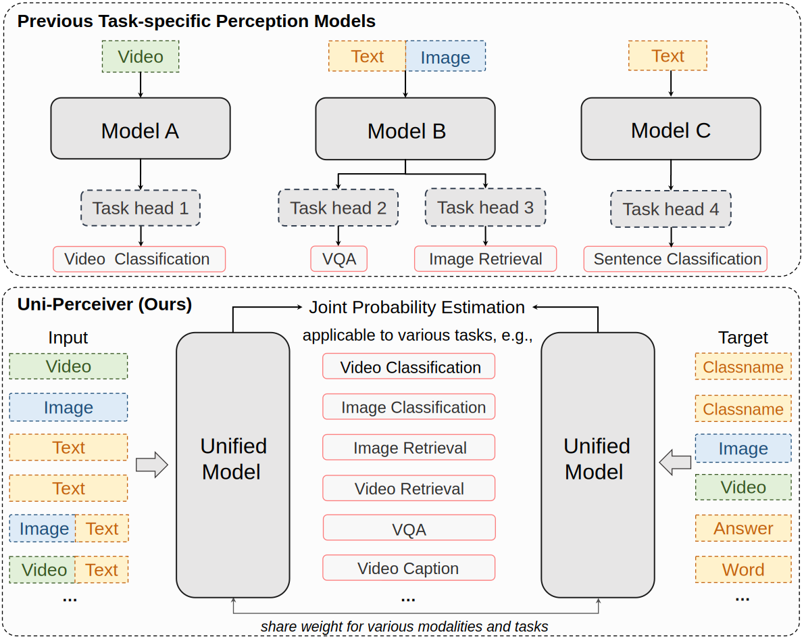
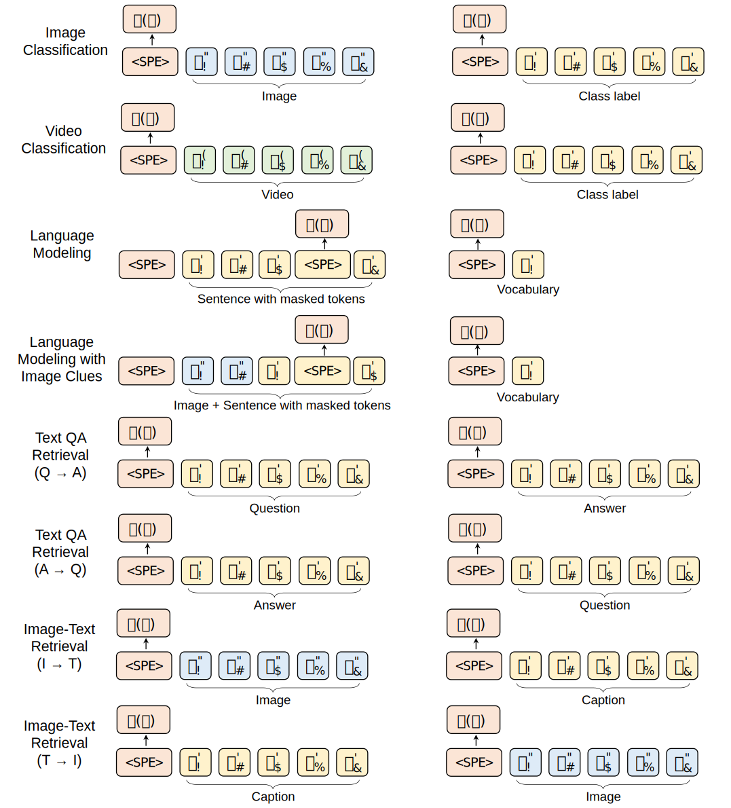

!!! abstract "摘要"

    本文提出Uni-Perceiver，将不同模态的输入映射到一个同一个嵌入空间中，然后通过一个模态无关的统一模型来提取表示。
    通过在不同模态的不同任务的多个数据集上训练，即使在全新任务上Uni-Perceive不经过任何微调也可以达到合理的性能，使用1%数据进行Prompt即可以达到接近SOTA的表现，微调之后可以达到甚至超过SOTA结果。

## 动机

传统深度神经网络模型都是面向某一特定任务的。
因此，为了新的任务通常需要训练新的神经网络。
这是一个非常消耗资源的过程，阻止了神经网络模型的普及。

## 原创

<!-- 因此，现有模型大都是为了某一特定任务而专门设计。
比如卷积神经网络[@AlexNet, @ResNet]大都在视觉任务中应用，而变换网络[@BERT, @GPT]通常在语言任务中使用。 -->
开发一个适用于多种模态的通用深度神经网络一直被认为是一个很艰难的问题。
一些工作[@CLIP, @UniT, @VATT, @ViLT]通过任务相关的令牌器将视觉数据和语言数据映射到同一嵌入空间，然后将这些嵌入空间的表示作为输入传递给一个模态无关的统一模型来进行预训练。
但是这些工作仍然需要在下游任务上微调，因为下游任务通常需要一个为任务设计的预测头。

本文提出一个孪生结构，通过任务相关的令牌器将不同模态的输入和目标编码到同一空间，然后通过一个任务无关的模型来提取特征，通过输入和目标的联合概率估计来训练模型。

## 方法

### 模型

Uni-Perceiver由两个部分组成：任务相关的令牌器和任务无关的编码器。

#### 令牌器

1. 文本：`BPE (subword)`令牌器[@Subword]
2. 图像：`image patch`令牌器[@ViT]
3. 视频：`temporal frame patch`令牌器[@TimeSformer]

#### 编码器

### 数据集

### 预训练

