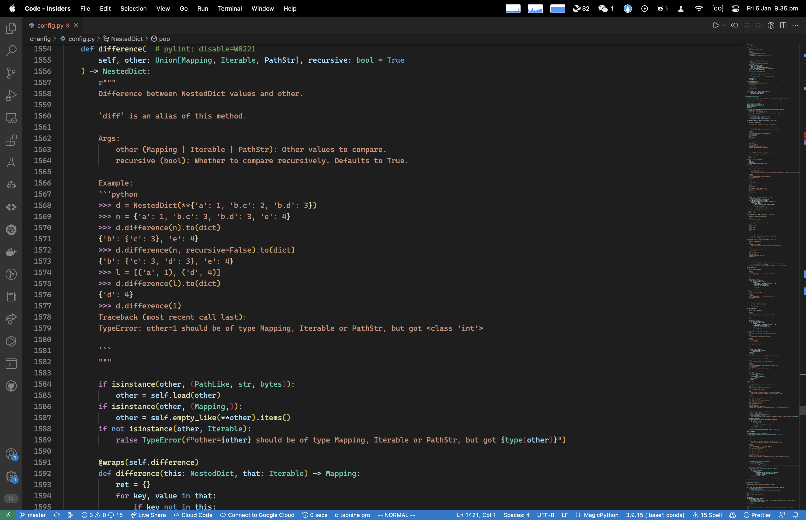

---
authors:
    - zyc
date: 2022-12-23 10:07:18
categories:
    - sketch
tags:
    - Python
    - Software Engineering
---

# Python软件工程：以CHANfiG为例

!!! abstract "前言"

    我注意到有很多同学的代码其实并不太符合各种规范，这在个人随便写的小玩具当中并不需要过多注意，但对于面向大众的开源项目来说并不优雅。此外，开源项目还需要恰当的docstring和doctest来进行文档生成和编辑器提示以及测试。因此，我撰写这篇文章来简要介绍一些软件工程代码当中的小工具。

本文面向有一定经验的Python使用者，他应该对Python有一定理解，能够恰当的组织和抽象代码。但他还没有养成撰写规范的软件工程代码的意识。

本文主要包括两个部分。在第一部分中我们将讨论Python代码规范和文档。在第二部分中，我们将介绍几个常见的代码格式化和静态分析以及测试工具，并给出他们在CI中的实际例子。

本文以[CHANfiG](https://github.com/ZhiyuanChen/CHANfiG)作为例子，部分代码被修改来更好的展示功能。

## 代码规范

### 规范

在所有Python代码规范当中，最出名的莫过于PEP 8。
我们相信，很多Python的使用者都在此前也至少听说过他的名字。

PEP 8规定了Python的indent、行长度、空行、import、注释、命名等诸多细节。

由于Python是一个鸭子类型的语言，因此对Python代码进行静态分析难于登天。
PEP 483介绍了类型注解（Type Hint）的概念并在PEP 484中正式引入Python。
此后，由于类型注解的概念引入的时间较晚，还有一系列PEP来进行补丁，比如PEP 505、PEP 544、PEP 584、PEP604、PEP 3141等。

类型注解主要在两个地方当中使用到：

1. 函数参数
2. 类定义

在这里，我们想要特别强调Optional这一类型注解。
他的名字很容易让人产生歧义，以为是用来表示这个参数的传递是可选的，因而应对所有有默认值的参数加上Optional注解。
但其实Optional指的是这个参数可以为None，也即Optional int和Union None int是完全等价的。
从某种角度来说，或许将其命名为Nullable会更合适。

### docstring与doctest

很多同学在写代码过程中都很不爱写docstring和doctest（我也是）。
直到后来我发现很多代码的文档和样例都是通过docstring和doctest直接生成的…
并且这些docstring和doctest也可以被现代编辑器所识别，从而帮助用户使用代码。
因此，我们强烈建议在任何对外部暴露的接口中加入合理的docstring和doctest。

如图所示的代码生成的文档和编辑器提示如下：




## 工具

最常用的代码格式化工具为black和yapf。
yapf是Google开发的一个格式化工具，他有很多的自定义选项让你能“完美”的格式化你的代码。
但是，过多的自由会导致项目之间采用不同的规范，并且团队内部也可能会因为对某种规范的偏好而产生不必要的纠结。
因此，我们更推荐使用black。他几乎没有什么可以配置的选项。你只需要指定一个max_line_length就好。

此外，black并不擅长解决`import`的问题，因此我们还需要使用isort来对import进行排序。

尽管black+import能够修复90%的问题，但仍然有些问题需要手动修复。
为了查找这些问题，三个库通常被使用，他们为pycodestyle、flake8和pylint。

其中，pycodestyle和flake8主要检测不符合PEP 8规范的代码，最常见的错误包括方法/函数定义超长和注释超长。
flake8同时也可以检测到未使用的imports、多个空行、没有正确使用空格等问题。

pylint则是一个更加强大的静态代码分析工具，他可以检测到更多的代码问题，包括大段重复的代码、不必要的else/return、不合规范的变量名等。
得益于它是一个静态分析工具，他还能检测到非法访问变量等问题。
pylint在最后还会给代码质量赋予一个0-10的评分，我们通常会认为一个9.0以上的代码质量是可以接受的。

尽管pylint可以帮助我们检测到更多的问题，但他并没有利用到类型注解的信息。
mypy是一个静态类型检查工具，它能够为我们补足这一短板并确保代码的正确性。

### 提交前钩子（Pre-Commit Hooks）

一个常见的提交前钩子长得如下

```python
dir=“.”
black --line-length 120 $dir
isort --line-length 120 $dir
pycodestyle --max-line-length 120 $dir
flake8 --max-line-length 120 $dir
pylint --max-line-length 120 $dir
```

### 合并规则

以下merge_rule要求在`chanfig/`目录下有文件修改时，代码在合并前必须通过在下文中定义的lint action，并且需要ZhiyuanChen的批准：

```yaml
- name: merge
  patterns:
  - chanfig/**
  approved_by:
  - ZhiyuanChen
  mandatory_checks_name:
  - lint
```

### 代码检查

以下action会在master和main分支上有提交或者有拉取请求（pull request）时检查代码是否符合规范：

```yaml
name: lint
on:
  push:
    branches:
      - master
      - main
  pull_request:
jobs:
  lint:
    environment: lint
    runs-on: ubuntu-latest
    steps:
      - uses: actions/checkout@v3
      - uses: ricardochaves/python-lint@v1.4.0
        with:
          python-root-list: "chanfig"
          extra-pylint-options: "--max-line-length 120"
          extra-pycodestyle-options: "--max-line-length 120"
          extra-flake8-options: "--max-line-length 120"
          extra-black-options: "--line-length 120"
          extra-mypy-options: ""
          extra-isort-options: "--line-length 120"
```

### 代码打包与发布

以下action会在有新的tag时对代码进行构建，创建一个新的GitHub Release并将代码发布到PyPI：

```yaml
name: release
on:
  push:
    tags:
      - "v*"
jobs:
  release:
    environment: pypi
    runs-on: ubuntu-latest
    steps:
      - uses: actions/checkout@v3
      - uses: actions/setup-python@v4
        with:
          python-version: 3.x
      - uses: Gr1N/setup-poetry@v7
      - name: install building dependencies
        run: poetry self add "poetry-dynamic-versioning[plugin]"
      - uses: actions/cache@v3
        with:
          path: ~/.cache/pypoetry/virtualenvs
          key: ${{ runner.os }}-poetry-${{ hashFiles('poetry.lock') }}
      - name: build package
        run: poetry build
      - name: create release
        uses: "marvinpinto/action-automatic-releases@latest"
        with:
          repo_token: "${{ secrets.GITHUB_TOKEN }}"
          prerelease: false
          files: |
            dist/*
      - name: publish to PyPI
        uses: pypa/gh-action-pypi-publish@release/v1
        with:
          password: ${{ secrets.PYPI_API_TOKEN }}
```

### 文档生成

以下action会在master和main分支上有提交或者有拉取请求（pull request）时构建文档网站并将其发布到GitHub Pages上：

```yaml
name: docs
on:
  push:
    branches:
      - master
      - main
  pull_request:
jobs:
  pages:
    environment: mkdocs
    runs-on: ubuntu-latest
    permissions:
      contents: write
    concurrency:
      group: ${{ github.workflow }}-${{ github.ref }}
    steps:
      - uses: actions/checkout@v3
      - uses: actions/setup-python@v4
        with:
          python-version: 3.x
      - name: Get pip cache dir
        id: pip-cache
        run: echo "::set-output name=dir::$(pip cache dir)"
      - uses: actions/cache@v3
        with:
          key: ${{ github.ref }}
          path: .cache
      - run: pip install git+https://${{ secrets.GH_TOKEN }}@github.com/squidfunk/mkdocs-material-insiders.git
      - run: pip install -r requirements.txt
      - run: mkdocs build
      - name: Deploy
        uses: peaceiris/actions-gh-pages@v3
        if: ${{ github.ref == 'refs/heads/master' }}
        with:
          github_token: ${{ secrets.GITHUB_TOKEN }}
          publish_dir: ./site
```
