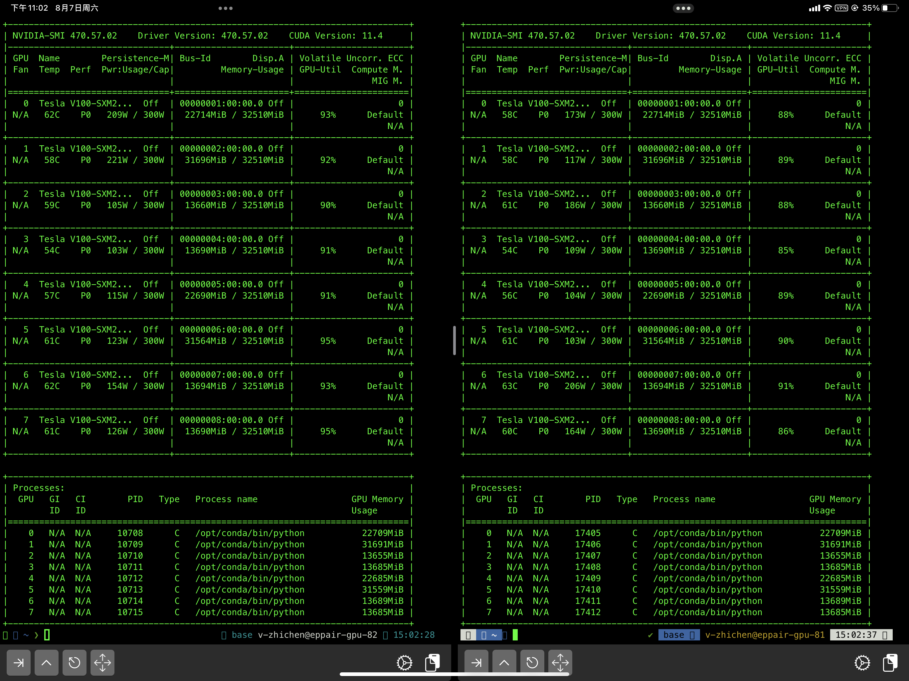

---
authors:
    - zyc
date: 2021-08-07 21:10:04
categories:
    - sketch
    - review
tags:
    - sketch
    - review
---

# iPad Pro简评

!!! abstract "前言"

    让我们把时间拨回到2019年12月。我在入职商汤之前两天到了北京。那几天忙着各种事情没玩iPad，等想玩的时候却惊讶的发现，iPad丢了。这对我来说无疑是一个晴天霹雳。于是只好把购置新iPad列入2020年的预算案。然后，2020年苹果发布的"新"iPad Pro，竟然只是2018款改了个名字……哪怕微软以善改名闻名于世也没做出过这种，这种事情吧？在矮子里面拔将军的情况下，当年购入Surface Book来缓解没有平板可用的燃眉之急。Surface Book力争用一台设备做好所有事情，可惜的是，他没能做好哪怕一件事情。于是今年做预算案的时候又把iPad做进来了。甚至于说，当我3月入职微软的时候做的第一件事就是申请把iPad带进公司--在那个时候，别说这台iPad还没被造出来，他离发布甚至都还有两个月。5月，当他发布之时我第一时间找到同学买下了他。然鹅由于下手晚了一步，预计到货时间是6月底……甚至在我计划离职时间之后。因此我在很久之前就决定等拿到之后写一篇文章纪念一下，顺便也相当于一个简短的评测。
    
    今天，他，终于，到了。

让我想想，让我们从总结开始吧。

你的下一台电脑，

何必是一台电脑？

作为一个搞算法的，我们的一天可以被三件事所总结：写代码、跑实验、看论文。在这三件事情上，iPad都做到了一定的可用性与足够的易用性，打分如下：

1. 写代码：3
2. 跑实验：4
3. 看论文：6

截至目前，写代码这件事情仍然存在一些问题。本文是通过访问GitHub Codespaces写的。而对于不在GitHub上的日常项目来说，目前只能通过code-server解决。至于[vsc for iPad](https://github.com/microsoft/vscode/issues/70764)……我只能说，希望已经出现在地平线上了吧（不过目前我替代方案用起来并没有什么问题，所以无所谓啦

我之前在商汤的时候曾尝试过手机上用Terminus跑实验，那真是一场无比痛苦的噩梦。Terminus这种三十秒钟就自动断连的东西应该被挂在历史的耻辱柱上令人唾弃。令人高兴的是，其实还是存在会写代码的人在给iOS写程序，比如说iSH。他几乎可以满足我的所有需求--除了窗口使用的是苹果自带的所以不太好用之外。此外，还有一些瑕不掩瑜的小缺陷，比如对zsh支持不够完善以及实在有点儿丑……。

iPad看论文体验一直以来都远不如Surface--甚至于说，我会认为看论文是Surface比iPad唯一的优点（当然其实就这三点来说的话苏菲其实每一点做的都比iPad更好……然而使用体验确实实在不大行。但是，现在不同了，虽然还是没有Drawboard那样的杀手级程序，PDF Expert在看论文方面其实没有差别很大。而Zotero的评估版本已经来到了129，用起来没有什么问题。

抛开了工作说说娱乐。因为嫌弃手机屏小，我已经有阵子没打开B站没追过剧了（这个故事告诉我们，别买iPad，由俭入奢难啊（误。但或许是看多了好屏幕，iPad这块mini LED屏幕除了真的很亮之外对我来说并没有啥感觉。而之前一直觉得很优秀的音质在小爱音箱之前也一败涂地……但是总的来说还是娱乐先锋（当然能支持switch做信号输入就更好了

从我拿到机器到现在不过几个小时，仅仅拿他跑了两个实验看了会儿论文刷了一阵小破站，哦对了还有写了这篇短文。或许也没啥能补充的了～

 

辛丑年立秋

于海淀路社区
