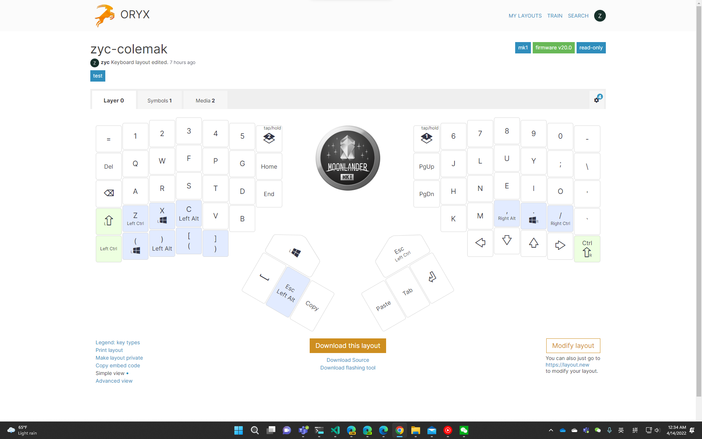

!!! important "利益声明"

    本文作者均非zsa公司及其附属和关联公司的员工、合同员工或外部员工，且与zsa公司及其附属和关联公司不存在关联或者共同利益。
    本文作者不会因为本文的发表获取任何形式的利益。本文所涉产品均为自行购买，没有收到任何形式的资助和赞助。

!!! abstract "前言"

    你真的需要一个分体式键盘吗？

这个问题我曾在去年七月问过我自己。如今，在超过两千个小时的使用之后，我们终于可以得到一个初步结论：

真的。

坐在电脑前其实是一件比较辛苦的事。我付出过大量努力来让我过的更舒服一些。这包括腰靠、头枕、键盘等。一次偶然的机会，我得知了分体式键盘的存在。于是，很快，来自zsa的Moonlander MK I到了我的手上。

最初，我本以为这样大的布局的变动会有很大的学习成本，但或许是得益于我此前专门学习过的打字，我几乎没有遇到任何问题便上手了（而这在后期成为了一个问题）。起初，我对默认布局的修改很少，因为我担心我以后会需要用到别的键盘（如出差用笔记本时）或是会有人需要用我的键盘（如帮我debug时），如果对非常规布局过于依赖会有不必要的麻烦。

事实证明，我的假设过于保守。过年期间，为了能够更高效的远程，我添置了一把蓝牙键盘。很快我便痛苦的意识到我已经完全无法容忍传统布局：我CapsLock的位置是Backspace，上面Tab位置是Delete，而Tab被挪到了拇指区，如下图所示。不幸的是，CoPilot和TabNine让我对Tab的依赖超出了我的想象。Moonlander并不是一款完美的键盘。他虽然做的很轻薄，但缺乏无线的他并不便于在外使用（别忘了，你还需要一根额外的TWRP线来连接两个部分），或许只能通过自己造来解决。这无疑是一个极其沉重的代价。因此，我们不推荐任何人选择分体式键盘。

随后，我们终于迈出了那一步：切换至Colemak布局。这是噩梦的开始。盲打其实并不需要你记住每一个按键的位置，而是在更深层次建立一种更直接的映射。打破这种既有映射是一个非常痛苦的过程，需要你集中全部精神才能勉强打字。我的打字速度由120wpm下降到不足10wpm。但这也是一种不可逆的操作。我尝试过切换回qwerty布局，虽然熟悉，但却难以容忍那种指头乱飞的感觉了。

如果你还没有被劝退的话，上图布局的链接是[https://configure.zsa.io/moonlander/layouts/J0zD9/](https://configure.zsa.io/moonlander/。layouts/J0zD9/)。目前刚刚迭代到第二代，第一页的内容已经进入最终测试。当然，如果你还是更喜欢qwerty布局的话，也可以看看[这个](https://configure.zsa.io/moonlander/layouts/L57aM/)，但是又有谁会更喜欢qwerty呢？

&nbsp;

壬寅年晚春

于丹棱街5号
