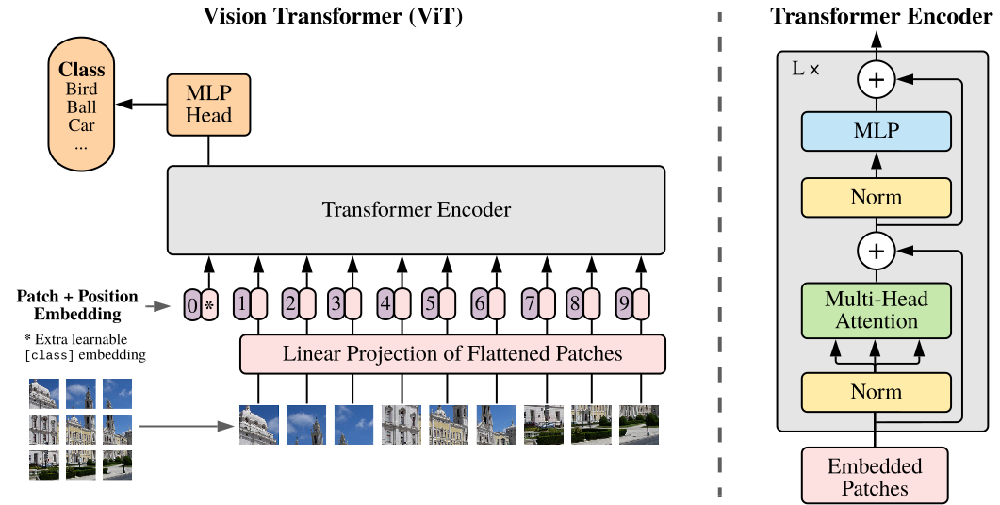

$$
\newcommand{\valstd}[2]{#1 {\scriptstyle \,\pm\, #2}}
\newcommand{\valstdb}[2]{\mathbf{#1} {\scriptstyle \,\pm\, #2}}
$$

## 动机

基于自注意力的结构，尤其是Transformer已经在自然语言处理中成为了首要选择。通行的做法是在大规模文本语料库上进行预训练，然后在更小的任务相关数据集上微调。得益于Transformer的计算高效和可扩展性，我们得以训练前所未有的规模的神经网络--超过1000亿参数。并且在模型和数据增大的情况下，仍然没有性能饱和的迹象。

但在计算机视觉中，卷积结构还保持统治性地位。本文将一个标准的Transformer直接应用在图像上，仅有极少修改。为此，本文将一张图片分割成多个块，然后将这些块的线性嵌套的序列作为Transformer的输入。图像块和NLP任务中的令牌（单词）一样被对待。

本文的模型在ImageNet这样的中等规模数据集上训练时与相近大小的ResNets相比略低几个百分点。这个结果或许是被期待的：Transformer缺乏CNN固有的一些归纳偏见，例如平移同变性和局部性。因此在没有足够的数据进行训练时泛化性稍差。

但在训练数据充分时（14M-300M）结果反了过来。本文发现大规模训练可以胜过归纳偏见。Transformer在以足够的数据预训练然后以很少的数据迁移到特定任务时达到了极好的结果。本文提出的ViT，在JFT-300M数据集上时，在多个图像识别任务中达到了SOTA结果。ImageNet 88.36%、ImageNet-ReaL 90.77%、CIFAR-100 94.55%、VTAB 19任务77.16%。

## 方法

本问尽可能地遵循了传统的Transformer结构，因此传统的Transformer和他们的实现几乎可以开箱即用。本文展示了在适当缩放的情况下，Transformer足以胜过最强的卷积神经网络。

### 结构

图1描述了Vision Transformer的结构。标准Transformer的输入是1维的令牌嵌套的序列。为了支持2维图像，本文将图像$\mathbf{x} \in \mathbb{R}^{H \times W \times C}$重塑成一系列展平的2维块$\mathbf{x}_p \in \mathbb{R}^{N \times (P^2 \cdot C)}$，其中$(H, W)$是原始图像的分辨率，$C$是通道的数量，$(P,P)$是每个图像块的分辨率，$N=HW/P^2$是块的数量，它同时也是Transformer的实际输入序列的长度。Transformer在所有层的宽度是恒定的，因此一个可训练的线性映射将每个矢量化的块映射到模型维度D（公式1），本文将这个映射的输出称为块嵌套。

!!! note "类别嵌套"

    与BERT的$\verb|[class]|$令牌相似，本文在块嵌套序列（$\mathbf{z}_0^0=\mathbf{x}_\text{class}$）前添加了可学习的类别嵌套，它的状态在Transformer编码器（$\mathbf{z}^0_L$）的输出作为图像表达$\mathbf{y}$。

!!! note "位置嵌套"

    为了保留位置信息，本文在块嵌套中添加了位置嵌套。本文使用标准的可学习的1维位置嵌套，因为2维位置嵌套没有带来显著的提升。添加了位置嵌套和类别嵌套的嵌套向量序列被用作编码器的输入。

Transformer编码器由交替的多头自注意力（MSA）（公式2）和多层感知机（MLP）（公式3）块构成。Laynorm（LN）被用在每个快之前，残差连接被加在每个块之后。多层感知机由两个带有GeLU的全连接层构成。

\begin{align}
    \mathbf{z}_0 &= [ \mathbf{x}_\text{class}; \, \mathbf{x}^1_p \mathbf{E}; \, \mathbf{x}^2_p \mathbf{E}; \cdots; \, \mathbf{x}^{N}_p \mathbf{E} ] + \mathbf{E}_{pos},
    && \mathbf{E} \in \mathbb{R}^{(P^2 \cdot C) \times D},\, \mathbf{E}_{pos}  \in \mathbb{R}^{(N + 1) \times D} && 1 \\
    \mathbf{z^\prime}_\ell &= \operatorname{MSA}(\operatorname{LN}(\mathbf{z}_{\ell-1})) + \mathbf{z}_{\ell-1}, && \ell=1\ldots L && 2 \\
    \mathbf{z}_\ell &= \operatorname{MLP}(\operatorname{LN}(\mathbf{z^\prime}_{\ell})) + \mathbf{z^\prime}_{\ell}, && \ell=1\ldots L  && 3 \\
    \mathbf{y} &= \operatorname{LN}(\mathbf{z}_L^0) && 4
\end{align}

### 混合架构

除了将图片直接切块输入之外，输入序列也可以由CNN的特征图构成。在这个混合模型中，块嵌套映射$\mathbf{E}$（公式1）被应用到从CNN特征图上提取的块。块可以有$1 \times 1$的空间大小，这意味着输入序列可以通过简单地展平特征图的空间尺寸并投影到Transformer维度获得。类别嵌套和位置嵌套被照常添加。

??? tips "版本区别"

    在arxiv版中，“块嵌套映射$\mathbf{E}$（公式1）被应用到从CNN特征图上提取的块”被表述为：块嵌套映射$\mathbf{E}$（公式1）被ResNet的前几个块替换。

### 微调

在微调中，本文移除预训练的预测头，然后接上一个0初始化的$D\times K$全连接层，其中$K$为下游类别的数量。本文在微调时使用更高分辨率的图像，并保持块大小不变，这使得实际序列长度增加。ViT可被用在任何长度的序列上，但预训练的位置嵌套可能会不再有意义。因此，本文对预训练的位置嵌套执行2维插值。注意，分辨率调整和块提取是唯一将图像的2维结构的归纳偏见插入到ViT的地方。

## 实验

本文评估了ResNet、ViT和混合模型的表达的学习能力。在考虑到预训练模型的计算消耗时，ViT的性能非常好，它在最多测试上达到SOTA结果，而预训练成本更低。本文还少量进行了自监督实验并展示了自监督的ViT有很大希望。

### 设置

#### 数据集

本文在ImageNet ILSVRC-2012（1k标签、1.3M图像）、ImageNet（21k标签、14M图像）、JFT-300M（18k标签、303M图像）上预训练，然后迁移到多个下游任务中，包括ImageNet ILSVRC-2012、ImageNet ReaL、CIFAR 10/100、Oxford-IIIT Pets、Oxford FLowers-102。对于这些数据集，本文使用[BiT](../vision/big_transfer)的预处理策略。

此外，本文还在19任务的VTAB测试上进行评估。VTAB评估使用1000个样本的少量数据迁移到多样性的任务中。任务可以被分为三个组：

+ *自然* 宠物、CIFAR等
+ *专用* 医学、卫星等
+ *结构性* 需要几何理解的任务，如定位

#### 模型变种

本文基于BERT来构建ViT配置。ViT-L/16表示大模型变种（L）和$16 \times 16$输入块大小（不同变种的配置见表1）。ResNet使用了[BiT](../vision/big_transfer)结构，将标准ResNet的BN替换成GN，并在卷积层应用了WS。混合架构将中间特征图以1个“像素”的块大小输入到ViT中。为了比较不同的序列长度，本文尝试了两种方案：

1. 提取常规R50的第4阶段的输出
2. 删除第4阶段，并在第3阶段放置相同数量的层（使得总层数仍为50），然后提取阶段3的输出。

选项2导致Transformer序列更长，这同时使ViT预测头更大。

!!! note "Transformer的序列长度"

    Transformer的序列长度为$image\_res^2 / patch\_size^2$

| 模型         | 层数 | 隐藏层大小 $D$ | MLP大小 | 头数 | 参数量  |
|------------|----|-----------|-------|----|------|
| \ViT-Base  | 12 | 768       | 3072  | 12 | 86M  |
| \ViT-Large | 24 | 1024      | 4096  | 16 | 307M |
| \ViT-Huge  | 32 | 1280      | 5120  | 16 | 632M |

#### 训练和微调

所有模型均使用Adam，$\beta_1 = 0.9, \beta_2 = 0.999$，批次大小为$4096$，权重衰减为$0.1$。本文采用了线性学习率预热和衰减策略。对于微调，本文使用带动量的SGD，批次大小为$512$。对于表2的ImageNet结果，本文使用更大的分辨率进行微调，ViT-L/16使用了512、ViT-H/14使用了518。后者还使用了Polyak & Juditsky (1992)平均，因子为0.9999。

#### 指标

本文通过少样本或微调的准确率来报告下游数据集的结果。少样本准确率通过解决将训练图像子集的（冻结）表示映射到$\{-1,1\}^K$个目标向量的正则化线性回归问题来获得。

|                    | ViT-JFT                 | ViT-JFT                 | ViT-I21K               | BiT-L                  | Noisy Student     |
|--------------------|-------------------------|-------------------------|------------------------|------------------------|-------------------|
|                    | (ViT-H/14)              | (ViT-L/16)              | (ViT-L/16)             | (ResNet152x4)          | (EfficientNet-L2) |
| ImageNet-1k        | $\valstdb{88.55}{0.04}$ | $\valstd{87.76}{0.03}$  | $\valstd{85.30}{0.02}$ | $\valstd{87.54}{0.02}$ | $88.4/88.5^*$     |
| ImageNet ReaL      | $\valstdb{90.72}{0.05}$ | $\valstd{90.54}{0.03}$  | $\valstd{88.62}{0.05}$ | $90.54$                | $90.55$           |
| CIFAR-10           | $\valstdb{99.50}{0.06}$ | $\valstd{99.42}{0.03}$  | $\valstd{99.15}{0.03}$ | $\valstd{99.37}{0.06}$ | $-$               |
| CIFAR-100          | $\valstdb{94.55}{0.04}$ | $\valstd{93.90}{0.05}$  | $\valstd{93.25}{0.05}$ | $\valstd{93.51}{0.08}$ | $-$               |
| Oxford-IIIT Pets   | $\valstdb{97.56}{0.03}$ | $\valstd{97.32}{0.11}$  | $\valstd{94.67}{0.15}$ | $\valstd{96.62}{0.23}$ | $-$               |
| Oxford Flowers-102 | $\valstd{99.68}{0.02}$  | $\valstdb{99.74}{0.00}$ | $\valstd{99.61}{0.02}$ | $\valstd{99.63}{0.03}$ | $-$               |
| VTAB (19 tasks)    | $\valstdb{77.63}{0.23}$ | $\valstd{76.28}{0.46}$  | $\valstd{72.72}{0.21}$ | $\valstd{76.29}{1.70}$ | $-$               |
| TPUv3-core-days    | $2.5$k                  | $0.68$k                 | $0.23$k                | $9.9$k                 | $12.3$k           |
