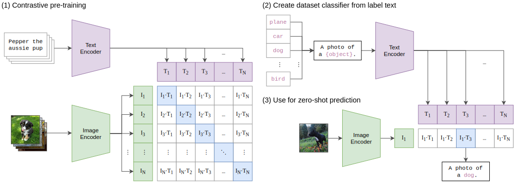

!!! abstract "摘要"

    本文提出一个新的预训练方式：预测图像的描述。
    通过在4亿图像文本对（来自于互联网）上进行预训练，本文在超过30个数据集的多种下游任务上均达到了SOTA结果。
    通过将自然语言与视觉概念进行关联，本文提出的方法在某些任务中无需任何数据微调即可达到SOTA结果，如ResNet-50[@ResNet]在ImageNet[@ImageNet]分类任务中。

## 动机

传统计算机视觉模型的主干网络通常都通过基于ImageNet[@ImageNet]图像分类任务的监督学习来进行训练。这使得他们极大的受限于有标注数据。
尽管以对比学习[@MoCo, @SimCLR]与重建学习[@MAE, @BEiT]为代表的自监督学习缓解了有标注数据不足的问题，但他们仍需要微调来应用在实际任务上。

## 原创

自Mori et al., (1999)[@mori1999image]以来，已经有数个方法来关联图像和其描述，但是他们的性能都不尽人意，Li et al., (2017)[@li2017learning]的方法在ImageNet[@ImageNet]分类任务的零样本学习中只取得了$11.5\%$的准确率，这与SOTA相去甚远。

此前已经有多个工作讨论在大规模数据集上通过弱监督进行训练[@JFT300M, @JFT3B, @NoisyStudent, @IG1B]，他们取得了出色的效果。
但是，他们都使用了一套精心设计的标签集，因而无法完全释放自然语言的潜能。
这限制了他们在零样本学习任务中的性能。

尽管MS-COCO[@COCO]和Visual Genome[@VisualGenome]具有高质量且丰富的标注，他们只有约十万张图像因而不满足要求。
YFCC100M[@YFCC100M]具有超过一亿张图像，但他们的元数据较为稀疏且质量良莠不齐。在通过判断标题和描述是否包含英文的自然语言进行筛选后，数据集仅剩约一千五百万张图像，与ImageNet[@ImageNet]大小相当。

本文的核心贡献包括以下三点：

1. 本文提出了通过一个简化版的ConVIRT[@ConVIRT]结构来进行图像和其描述之间的对比学习。
2. 本文构建了构建了一个有4亿张图片及对应的描述文本的大规模数据集上来训练所提出的模型。
3. 本文构建了横跨两个数量级的八个模型来验证这个方法，结果表明迁移性能是一个与计算量有关的平滑的可预测方程[@hestness2017deep, @ScalingLaws]。

## 方法

### 模型

本文将图像和文本分别经过一个独立的编码器来提取特征，然后通过一个线性映射层来将特征映射到同一空间。本文没有使用SimCLRv2[@SimCLRv2]中额外的非线性映射层，因为他没有带来额外收益。本文猜想只有同一模态的对比学习才需要额外的非线性映射层。

#### 视觉

本文探究了两种视觉编码器，ResNet[@ResNet]和ViT[@ViT]。所有模型都没有使用任何预训练的权重，从头训练。

1. ResNet[@ResNet]：本文使用了一个ResNet[@ResNet]的改进版ResNet-D[@bot]模型。将池化层替换为Zhang (2019)的`antialised rect-2 blur`池化层。将最后的全局平均池化层替换为一个类似于自注意力机制的注意力池化层。
2. ViT[@ViT]：本文几乎没有对ViT进行修改，除了在`stem`和`pos embed`之后加入了一个`LN`层。

#### 语言

本文使用了一个GPT-2[@GPT-2]方式的Transformer[@Transformer]来作为语言模型。
为了训练效率，序列长度被限制为76。
在句子的开始和结束有`[SOS]`和`[EOS]`令牌，最后一层的`[EOS]`令牌被用做文本的特征。

#### 扩展

遵循EfficientNet[@EfficientNet]，本文在扩展模型时同时扩展了视觉模型的深度宽度和分辨率；对于文本模型则只有宽度被扩展，本文发现CLIP对语言编码器的容量不敏感。

### 数据

本文从英文版维基百科[@wikidump]中筛选了所有出现至少100次的二元词组，最终构成了一个50万个词组的词典。
然后，根据词典中的查询词在互联网上爬取（图像，文本）二元组。
爬取得到的数据会按照查询词进行均衡，最终每个查询词约包括2万（图像，文本）对。
本文将这一数据集称为WIT (WebImageText)。
WIT的总单词量与GPT-2[@GPT-2]的WebText数据集的总单词量相当。

### 训练

最开始，和VirTex[@VirTex]相似，本文联合训练一个图像卷积网络和文本变换网络来预测图像的描述。但是，这种方法速度很慢，难以高效的扩展。

本文认为这一部分是因为这个任务对每张图像预测其描述的确切原文。由于图像的描述具有巨大的多样性，这种训练非常困难。将文本预测目标从预测确切的原文更换为这些词的词袋向量，速度即可提升三倍。

此前研究发现对比学习比预测任务能得到更好的表示[@CMC]，因此本文进一步将训练目标更换为类似于的对比学习，取得了额外的四倍提升。

本文的训练设置遵循了ConVIRT[@ConVIRT]的实现，下图描述了损失函数的伪代码。

## 实验

TODO
